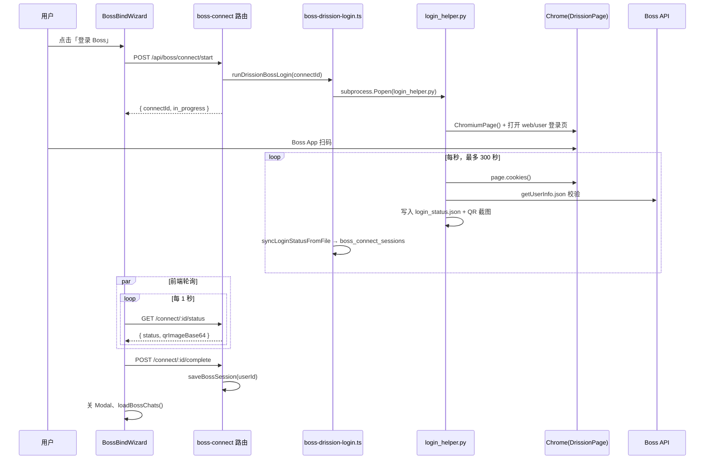
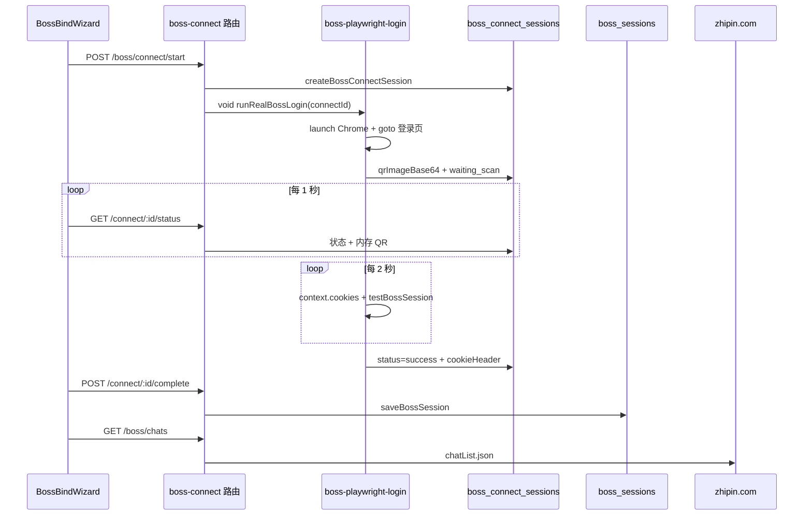

# Boss 直聘登录 — 实现逻辑说明

**项目**: Offer通 (`mianshi`)  
**更新**: 2026-06-12  
**主路径**: **DrissionPage 子进程** + `boss_utils` 共享模块  
**兜底**: Playwright headless（DrissionPage 不可用时）

---

## 0. 参考实现对齐（2026-06-12）

已按成熟项目规范复刻核心层，**双模式共存**：

| 能力 | 路径 | 说明 |
|------|------|------|
| Cookie 持久化 | `mianshi-worker/data/cookies.json` | 浏览器 cookie 数组，全实例单文件 |
| 共享工具 | `mianshi-worker/app/boss/boss_utils.py` | save/load/validate/注入 |
| 扫码脚本 | `mianshi-worker/scripts/login_helper.py` | 独立模式 + connect 绑定模式 |
| 子进程管理 | `mianshi-worker/app/boss/login_manager.py` | 线程锁 + `login_process` |
| 登录日志 | `mianshi-worker/logs/login.log` | `setup_logging()` |
| Worker API | `http://localhost:8790/api/*` | 见下表 |
| Web 绑定 API | `http://localhost:8788/api/boss/connect/*` | 多用户 → `boss_sessions` |

### Worker 登录 API（与参考项目一致）

| 方法 | 路径 | 行为 |
|------|------|------|
| GET | `/api/status` | `{ logged_in, cookie_exists, login_in_progress, message }` |
| POST | `/api/login` | subprocess 启动 `login_helper.py`（无参数）；防重复 |
| GET | `/api/login/check` | 实时 `check_login_status()` + in_progress |
| POST | `/api/logout` | 删 `cookies.json`、terminate 子进程 |

### 权威校验

- URL: `GET https://www.zhipin.com/wapi/zpuser/wap/getUserInfo.json`
- `code === 0` 且 `zpData` 有内容 → 有效
- `code === 7` → 未登录，删除本地 cookie 文件
- 关键 Cookie（至少命中 2 个）: `wt2`, `__zp_stoken__`, `geek_name`

### login_helper.py 流程

1. `check_login_status()` — 本地 cookie 有效则直接 exit 0
2. DrissionPage 打开 `https://www.zhipin.com/web/user/?ka=header-login`
3. 轮询 300s：关键 Cookie ≥2 → `test_cookie_valid()` → `save_cookies()`
4. 备用：每 3s DOM 检测 `.user-name` 等
5. connect 模式额外写 `login_status.json` + `storage/connect/{id}/cookies.json`

### 启动 Worker

```powershell
cd mianshi-worker
.\.venv\Scripts\pip.exe install -r requirements.txt
$env:WORKER_MODE="http"
.\.venv\Scripts\python.exe main.py
```

独立触发登录：`POST http://localhost:8790/api/login`

---

## 0. 主流程时序（DrissionPage，与参考项目对齐）



| 参考项目 | Offer通 对应 |
|----------|----------------|
| `POST /api/login` | Worker `POST /api/login`；Web 绑定 `POST /api/boss/connect/start` |
| `login_helper.py` | `mianshi-worker/scripts/login_helper.py` |
| `data/cookies.json` | `mianshi-worker/data/cookies.json`（+ connect 目录副本） |
| `boss_utils` | `mianshi-worker/app/boss/boss_utils.py` |
| `GET /api/login/check` | Worker `GET /api/login/check`；Web `GET /api/boss/connect/:id/status` |
| `login_in_progress` | `login_manager.login_status` + `activeJobs` Map |

---

## 1. 设计原则

| 要求 | 实现方式 |
|------|----------|
| 真实登录 | Playwright 打开 Chrome，用户 Boss App 扫码 |
| 会话持久化 | 扫码成功后 Cookie 加密写入 `boss_sessions` 表 |
| 对话拉取 | 后续请求带 Cookie 调用 Boss `chatList.json` 等 API |
| **不做** | 粘贴 Cookie、演示绑定、书签 `document.cookie`（缺 HttpOnly `wt2`） |

---

## 2. 总体流程

```
用户点击「登录 Boss」
    │
    ▼
BossBindModal → BossBindWizard.beginConnect()
    │  POST /api/boss/connect/start
    ▼
createBossConnectSession()          ← 临时 connect 会话（30min TTL）
    │
    ▼
runRealBossLogin(connectId)         ← 后台异步，不阻塞 HTTP 响应
    │  closeAllBossBrowsers()
    │  launchRealBossBrowser()      ← headless:false, launch+newPage
    │  navigateToBossLogin()
    │  publishPreviewToSession()      ← QR/登录区截图 → qrCache
    │  pollLoginCookies()             ← 每 2s 读 Cookie + testBossSession
    ▼
status = success, cookieHeader 写入 connect 会话
    │
    ▼
前端轮询 GET /status 发现 success
    │  POST /api/boss/connect/:id/complete
    ▼
saveBossSession(userId, cookie)     ← 持久化到 boss_sessions
    │
    ▼
GET /api/boss/chats                 ← fetchBossChatList(cookie)
```

---

## 3. 时序图



---

## 4. 关键文件索引

| 层级 | 文件 | 职责 |
|------|------|------|
| 前端入口 | `mianshi-frontend/src/pages/JobsPage.tsx` | 「登录 Boss」按钮、绑定成功后 `loadBossChats` |
| 弹窗 | `mianshi-frontend/src/components/jobs/BossBindModal.tsx` | 登录说明文案，挂载 Wizard |
| 绑定向导 | `mianshi-frontend/src/components/jobs/BossBindWizard.tsx` | start / poll / complete 全流程 |
| API 客户端 | `mianshi-frontend/src/api/client.ts` | `startBossConnect`、`getBossConnectStatus` 等 |
| HTTP 路由 | `mianshi-api/src/routes/boss-connect.ts` | connect 相关 REST 接口 |
| Playwright 兜底 | `mianshi-api/src/services/boss-playwright-login.ts` |
| **DrissionPage 子进程** | `mianshi-api/src/services/boss-drission-login.ts` |
| **Python 登录脚本** | `mianshi-worker/scripts/login_helper.py` | **核心**：开浏览器、导航、截图、Cookie 轮询 |
| Connect 存储 | `mianshi-api/src/services/boss-connect-store.ts` | 临时会话；QR 图仅内存 `qrCache` |
| 会话持久化 | `mianshi-api/src/services/boss-session-store.ts` | `boss_sessions` 读写（Cookie 加密） |
| Boss API | `mianshi-api/src/services/boss-client.ts` | `testBossSession`、`fetchBossChatList` |
| 对话路由 | `mianshi-api/src/routes/boss.ts` | `GET /boss/chats`、消息、回复 |
| 诊断脚本 | `mianshi-api/scripts/test-headed-login.ts` | 对比 launch vs persistent 空白页 |
| 诊断脚本 | `mianshi-api/scripts/test-connect-flow.ts` | 端到端 connect + QR 加载 |

---

## 5. API 接口

| 方法 | 路径 | 说明 |
|------|------|------|
| `POST` | `/api/boss/connect/start` | 创建 connectId，异步启动 Playwright |
| `GET` | `/api/boss/connect/:id/status` | 轮询：`status`、`qrImageBase64`、`error` |
| `POST` | `/api/boss/connect/:id/complete` | 需 JWT；将 connect Cookie 写入当前用户 |
| `POST` | `/api/boss/connect/:id/refresh` | 关旧窗口，重新打开登录页 |
| `DELETE` | `/api/boss/connect/:id` | 取消任务、关闭 Chrome |
| `GET` | `/api/boss/session` | 当前用户是否已绑定 Boss |
| `GET` | `/api/boss/chats` | 对话列表（依赖 `boss_sessions`） |
| `GET` | `/api/boss/chats/:jobId/messages` | 某职位聊天记录 |

---

## 6. 前端实现要点

### 6.1 入口（JobsPage）

- 工具栏 / Banner 点击 → `setBindModalOpen(true)`
- `onComplete` 回调：`loadBossSession()` + `loadBossChats()`，更新 `bossBound`

### 6.2 BossBindWizard 状态机

| phase | 含义 |
|-------|------|
| `starting` | 已调用 `startBossConnect`，等待 Chrome |
| `waiting` | 轮询中，展示 QR 预览或 loading |
| `success` | complete 成功 |
| `failed` | 超时或启动失败，展示 `error` |

### 6.3 核心代码路径

```text
beginConnect()
  → stopConnect(旧 connectId)     // DELETE 取消
  → api.startBossConnect()         // POST /start
  → startPoll(connectId)           // setInterval 1s

pollOnce()
  → api.getBossConnectStatus()
  → status === 'success' → finishSuccess()
       → api.completeBossConnect() // POST /complete

useEffect cleanup（组件卸载）
  → stopConnect(connectIdRef)      // 关弹窗时会取消后台任务
```

**注意**：React Strict Mode 开发环境下 effect 可能执行两次，第一次 cleanup 会 cancel 刚创建的任务；生产环境通常无此问题。

---

## 7. Playwright 实现要点

### 7.1 登录 URL

```text
https://login.zhipin.com/?ka=header-login
```

不使用 `www.zhipin.com/web/user`（易出现 `ERR_ABORTED`）。

### 7.2 浏览器启动方式（重要）

**当前方案**（2026-06-12 修复空白页后）：

```text
chromium.launch({ headless: false, channel: 'chrome'|'msedge'|... })
  → browser.newContext({ viewport, userAgent, locale })
  → context.newPage()
  → navigateToBossLogin(page)
```

**已废弃**（Windows 有界面模式会停在 `about:blank`）：

```text
chromium.launchPersistentContext(userDataDir, { headless: false })
```

本地验证（在 `mianshi-api` 目录下执行 `npx tsx scripts/test-headed-login.ts --headed`）：

| 方式 | 结果 |
|------|------|
| `launch + newPage` | ✅ 正常打开 Boss 登录页 |
| `launchPersistentContext` | ❌ `about:blank` |

### 7.3 导航重试

`navigateToBossLogin(page)`：

- 最多 3 次 `page.goto`，`waitUntil: 'load'`
- 等待选择器：`.sign-form`、`[class*="login-wrap"]` 等
- 失败抛错：`Boss 登录页加载失败，请检查网络或稍后重试`

### 7.4 QR 截图策略

1. `trySwitchToQrMode` — 点击登录框**右上角图标**切换二维码（**禁止**点击「APP扫码」文字，会导致白屏）
2. 若有 `canvas` → 截 canvas
3. 否则 `captureLoginPreview` — 截 `.sign-form` 等区域

截图写入 `boss-connect-store` 的内存 `qrCache`，**不入库**（体积大）。

### 7.5 登录成功判定

```text
context.cookies(['www.zhipin.com', 'login.zhipin.com'])
  → 检查 wt2 / zp_token / __zp_stoken__ / geek_zp_token
  → testBossSession(cookieHeader)
       → GET /wapi/zpgeek/common/data/getUserInfo.json
  → updateBossConnectSession({ status: 'success', cookieHeader, bossName })
```

轮询间隔 **2 秒**，总超时 **5 分钟**。

### 7.6 并发与清理

- `activeBrowsers: Map<connectId, { close }>` 跟踪实例
- 新任务开始前 `closeAllBossBrowsers()` 关闭所有旧窗口
- 任务结束 / 取消 / 超时 → `closeBrowser(connectId)`

---

## 8. 数据存储

### 8.1 临时 Connect 会话

**表**: `boss_connect_sessions`（或内存 Map，无 PG 时）

| 字段 | 说明 |
|------|------|
| `id` | `bconn*` connectId |
| `status` | pending / waiting_scan / success / failed / expired |
| `cookie_data` | 成功后加密 Cookie |
| `boss_name` | 扫码成功后 Boss 昵称 |
| `expires_at` | 30 分钟 TTL |

**QR 图片**: 仅 `qrCache` 内存，随进程重启丢失。

### 8.2 用户 Boss 会话（持久化）

**表**: `boss_sessions`

| 字段 | 说明 |
|------|------|
| `user_id` | Offer通 用户 ID |
| `cookie_data` | AES 加密 Cookie 串 |
| `boss_uid` / `boss_name` | Boss 账号信息 |
| `status` | active / expired / need_rebind |
| `profile_dir` | 可选 Playwright Profile 路径 |

写入函数：`saveBossSession()` in `boss-session-store.ts`  
触发时机：前端 `POST /connect/:id/complete` → `completeBossConnectForUser()`

---

## 9. 对话拉取链路

绑定成功后：

```text
JobsPage.loadBossChats()
  → GET /api/boss/chats
  → getBossSession(userId)
  → fetchBossChatList(session.cookieHeader)
  → Boss: /wapi/zpgeek/chat/geek/chatList.json
```

单职位消息：

```text
GET /api/boss/chats/:jobId/messages
  → fetchBossChatMessages(cookie, jobId)
  → Boss: /wapi/zpgeek/chat/geek/historyMsg.json
```

---

## 10. 环境变量

| 变量 | 默认 | 说明 |
|------|------|------|
| `PORT` | `8788` | API 端口 |
| `CORS_ORIGIN` | `http://localhost:5174` | 前端 Origin |
| `BOSS_CONNECT_CHANNEL` | 自动 | 强制 `chrome` / `msedge` |
| `BOSS_PROFILE_ROOT` | `mianshi-worker/storage/profiles` | 用户 Profile 目录 |

Playwright 依赖安装：

```bash
cd mianshi-api
npx playwright install chromium
```

---

## 11. 本地开发与排查

### 11.1 启动（PowerShell）

```powershell
# 终端 1 — API
cd mianshi-api
npm run dev

# 终端 2 — 前端
cd mianshi-frontend
npm run dev
```

访问：API `http://localhost:8788`，前端 `http://localhost:5174`

> Windows PowerShell **不支持** `&&` 链式命令，请分行执行，或用分号：`cd mianshi-api; npm run build`

### 11.2 安装 DrissionPage（推荐）

```powershell
cd mianshi-worker
.\.venv\Scripts\activate
pip install DrissionPage
```

### 11.3 手动验证 Playwright / DrissionPage

**必须先进入 `mianshi-api` 目录**（脚本在 `mianshi-api/scripts/`，不在项目根目录）：

```powershell
cd mianshi-api
npm run build
npx tsx scripts/test-headed-login.ts --headed
npx tsx scripts/test-connect-flow.ts
```

### 11.3 常见问题对照表

| 现象 | 可能原因 | 排查 |
|------|----------|------|
| Chrome 空白窗口 | 旧代码用 `launchPersistentContext`；或 API 未重启 | 看 API 日志是否有 `[boss-connect] login page ready: https://login.zhipin.com...` |
| 弹窗 QR 一直 loading | 截图失败 / connect 被取消 | Network 看 `/status` 的 `qrImageBase64`、`error` |
| 「已有登录任务进行中」 | 旧版全局锁（已移除） | 重启 API；关残留 Chrome |
| 扫码后无反应 | Cookie 未写入 / `testBossSession` 失败 | API 日志；检查 `wt2` 是否存在 |
| complete 400 | connect 过期或未 success | 看 `peekBossConnectCookies` 返回 |
| chats 为空 | 未 complete 或 Cookie 无效 | `GET /api/boss/session` 看 `bound` |

### 11.4 建议抓包位置

1. **API 终端** — `[boss-connect] login page ready:` 行
2. **浏览器 DevTools → Network**
   - `POST /api/boss/connect/start`
   - `GET /api/boss/connect/{id}/status`（看 `status`、`error`）
   - `POST /api/boss/connect/{id}/complete`
3. **任务管理器** — 是否有多余 `chrome.exe`（Playwright 启动）

---

## 12. 核心代码片段索引

便于 IDE 跳转（行号随改动可能漂移，以文件内搜索函数名为准）：

| 函数 | 文件 |
|------|------|
| `startBossConnectLogin` | `boss-playwright-login.ts` |
| `runRealBossLogin` | `boss-playwright-login.ts` |
| `launchRealBossBrowser` | `boss-playwright-login.ts` |
| `navigateToBossLogin` | `boss-playwright-login.ts` |
| `tryCaptureLoginFromContext` | `boss-playwright-login.ts` |
| `completeBossConnectForUser` | `boss-playwright-login.ts` |
| `createBossConnectSession` | `boss-connect-store.ts` |
| `saveBossSession` | `boss-session-store.ts` |
| `testBossSession` | `boss-client.ts` |
| `fetchBossChatList` | `boss-client.ts` |
| `beginConnect` / `pollOnce` | `BossBindWizard.tsx` |

---

## 13. 已知限制与后续方向

1. **Boss 反自动化** — 部分环境扫码页仅显示验证码登录；右上角图标切 QR 不一定成功。
2. **headed 模式依赖本机 Chrome/Edge** — 无 GUI 的服务器需另方案（如独立 Worker + DrissionPage）。
3. **QR 缓存非持久** — API 重启后进行中的 connect 需用户点「重新开始」。
4. **弹窗关闭即 cancel** — 用户误关弹窗会终止 Playwright 任务。

可选改进（未实现）：

- headed 导航失败时 fallback 到 headless 仅向弹窗推 QR
- connect 任务与前端 connectId 解耦，避免 Strict Mode 双挂载误 cancel
- 登录成功后自动触发 `boss-sync` 拉取历史对话

---

## 14. 文档修订记录

| 日期 | 变更 |
|------|------|
| 2026-06-12 | 初版：真实扫码流程、`launch+newPage` 修复空白页、移除演示/Cookie 绑定 UI |
