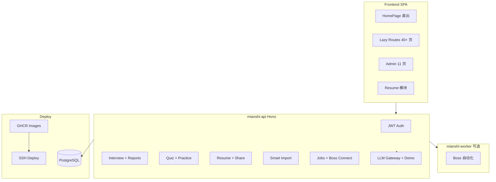

# mianshi 项目状态报告

> **更新**：2026-06-23（全量代码库对齐）  
> **范围**：mianshi-api · mianshi-frontend · mianshi-worker · deploy  
> **用途**：决策参考、迭代排期、文档索引

---

## 1. 执行摘要

mianshi 是一个 **AI 求职备战平台**，覆盖模拟面试、题库刷题、面经 UGC、简历工作台、智能投递（Boss）与运营后台。核心产品链路已可内测/种子用户使用；**生产部署脚手架就绪**，待 GitHub Secrets 与服务器 `.env` 配置后即可推送发布。

| 维度 | 得分 | 较上次 | 说明 |
|------|------|--------|------|
| **平台整体** | **8.2/10** | +0.4 | P0/P1 完成；P3 CD + chunk 拆分落地 |
| **简历模块** | **~92%** | +4% | 导入向导、分享过期、layout 隔离、移动端 Tab |
| **Boss 投递** | **~70%** | — | 架构完整；Worker 未纳入 prod CD |
| **生产就绪** | **~55%** | +10% | CI 全绿路径清晰；CD 缺 Secrets 配置 |
| **代码质量** | **~85%** | — | Golden Set 90 组 + 9 套 E2E；无 TODO/FIXME 残留 |

**当前阶段**：功能开发 **Phase 1～2 基本完成** → 进入 **运维上线 + polish** 阶段。

---

## 2. 模块进度矩阵

| 模块 | 完成度 | 状态 | 关键证据 |
|------|--------|------|----------|
| 模拟面试 + 报告 | **~92%** | 生产可用 | `routes/interview.ts`；E2E `interview-demo.spec.ts` |
| 题库 + 刷题 + 路线 | **~88%** | 稳定 | Golden Set 90 组；Quiz demo 降级 `quiz-score.ts` |
| 面经 UGC | **~85%** | 完整 | 审核流 + 候选题生成 |
| 运营后台 + 智能导入 | **~92%** | 增强 | LLM probe；field warnings；AI 补全缺项 |
| 简历工作台 | **~92%** | 主链路完成 | 见 [RESUME-LAUNCH-PLAN.md](./RESUME-LAUNCH-PLAN.md) |
| 智能投递 / Boss | **~70%** | 内测 | Worker 独立部署；Cookie 绑定路径 |
| 生产 CD | **脚手架 100%** | 待配置 | `cd.yml` + `GITHUB-SECRETS.md` |
| 前端性能 | **~90%** | 已优化 | 入口 chunk 65 KB（原 1072 KB） |

---

## 3. 代码库规模

| 指标 | 数量 |
|------|------|
| API 路由模块 | 21 个（`mianshi-api/src/routes/`） |
| API 源文件 | ~87 TS |
| 前端源文件 | ~193 TS/TSX |
| Worker 源文件 | ~23 Python |
| Admin 页面 | 11 个 |
| E2E 规格 | **9 文件 / 20 用例** |
| API 回归脚本 | 10 个（`mianshi-api/scripts/`） |
| Golden Set | 30 题 × 3 档 = **90 组**断言 |

---

## 4. 近期完成（按优先级）

### P0 — 商业阻塞（已全部完成）

| 项 | 状态 | 关键文件 |
|----|------|----------|
| Demo 模式强确认弹窗 | ✅ | `ResumeProvider.tsx`、`AdminImportPage.tsx` |
| 导入低置信度 fieldCoverage UI | ✅ | `ImportParseCompareModal.tsx`、`resume-field-coverage.ts` |
| 面试 demo E2E | ✅ | `e2e/interview-demo.spec.ts` |
| 导入向导三步 UI | ✅ | `ImportWizard.tsx` |
| LLM 健康探测 | ✅ | `llm-gateway.ts`；`?probe=1` 多端点 |

### P1 — 体验对齐（已全部完成）

| 项 | 状态 | 关键文件 |
|----|------|----------|
| 移动端简历 Tab（内容 \| 预览） | ✅ | `EditView.tsx` |
| 每份简历 layout 存 DB | ✅ | `resumeLayoutConfig.ts`、`useResumeAutoSave` |
| 扫描 PDF 错误码 + OCR 引导 | ✅ | `SCANNED_PDF_NEED_OCR`、`ScannedPdfGuide.tsx` |
| Admin「AI 补全缺项」 | ✅ | `AdminImportPage.tsx` `enrichSelected` |
| 分享 token 过期 | ✅ | `resume-share-store.ts`、`ResumeSharePanel.tsx` |

### P3 — 运维（部分完成）

| 项 | 状态 | 说明 |
|----|------|------|
| CD Secrets 文档 + 校验 | ✅ | `GITHUB-SECRETS.md`、`verify-github-secrets.ps1`、`validate-secrets` job |
| 前端 chunk 拆分 | ✅ | `lazyPages.ts` + `manualChunks`；入口 65 KB |
| CI bundle 预算检查 | ✅ | `check-bundle-size.mjs` |
| **配置 GitHub Secrets** | ⏳ | 需仓库管理员在 GitHub 操作 |
| APM / LLM 错误率告警 | ❌ | 未实现 |

---

## 5. CI/CD 与测试

### CI（`.github/workflows/ci.yml`）

```
api:  typecheck → quality:regression → test:quiz-score
      → test:resume-field-coverage → test:smart-import-batch → build
frontend: build → check:bundles
e2e:  Playwright 全量（9 specs）
```

### CD（`.github/workflows/cd.yml`）

```
validate-secrets → publish (GHCR api + web) → deploy (SSH, 需 5 个 Secret)
```

缺 Secret 时：**镜像仍 push**，deploy **跳过并告警**。

### 测试矩阵

| 命令 | 位置 | 覆盖 | CI |
|------|------|------|-----|
| `quality:regression` | api | Golden Set 90 组 | ✅ |
| `test:quiz-score` | api | Quiz demo 评分 | ✅ |
| `test:resume-field-coverage` | api | 字段覆盖率 | ✅ |
| `test:smart-import-batch` | api | 导入 unwrap/warnings | ✅ |
| `test:resume-all` | api | 4 项简历 API 回归 | ❌ 本地 |
| `test:e2e` | frontend | 20 用例 / 9 specs | ✅ |
| `check:bundles` | frontend | 入口 ≤350 KB | ✅ |

### E2E 清单

| Spec | 用例数 | 覆盖 |
|------|--------|------|
| `smoke.spec.ts` | 6 | 首页、导航 |
| `auth.spec.ts` | 2 | 登录 |
| `interview-demo.spec.ts` | 1 | 快速面试 → 报告 |
| `resume-crud.spec.ts` | 2 | 多简历 CRUD |
| `resume-import-wizard.spec.ts` | 2 | 导入向导 |
| `resume-export.spec.ts` | 3 | PDF/PNG 导出 |
| `resume-share.spec.ts` | 1 | 公开分享 |
| `resume-extended-modules.spec.ts` | 1 | 扩展模块 |
| `jobs-workbench.spec.ts` | 2 | 投递工作台 |

---

## 6. 架构概览



---

## 7. 差距与风险

### 高优先级（上线前）

| 风险 | 影响 | 建议 |
|------|------|------|
| GitHub Secrets 未配置 | CD deploy 跳过 | 按 `deploy/GITHUB-SECRETS.md` 配置 5 项 |
| Worker 不在 prod compose | Boss 自动化不可用 | 单独部署 worker 或文档说明 |
| `test:resume-all` 未进 CI | 简历 API 回归可能遗漏 | 加入 ci.yml api job |

### 中优先级（polish）

| 项 | 说明 |
|----|------|
| 分享过期 E2E | `resume-share.spec.ts` 未测 expiresInDays |
| pdf.js 块排序 | 双栏 PDF 乱序未 PoC |
| DOCX fixture 回归 | Phase 2 测试项未完成 |
| M10 投递摘要 UI | sync-summary API 有，岗位页卡片弱 |
| 服务端 PDF 稳定性 | 已有 endpoint，多页 edge case |

### 低优先级 / 已知限制

| 项 | 说明 |
|----|------|
| Demo 模式 | 无 `LLM_API_KEY` 时规则降级，已强确认 |
| 扫描 PDF OCR | 引导粘贴，无云 OCR |
| Boss 反爬 | 生产需 Cookie 粘贴，非全自动 |
| APM 告警 | P3 未做 |

---

## 8. 文档索引与同步状态

| 文档 | 用途 | 同步状态 |
|------|------|----------|
| **本文档** | 项目总进度 | ✅ 当前 |
| [RESUME-LAUNCH-PLAN.md](./RESUME-LAUNCH-PLAN.md) | 简历商业化路线 | 🔄 v1.2 已对齐 |
| [RESUME-USER-GUIDE.md](./RESUME-USER-GUIDE.md) | 用户帮助 | ✅ 当前 |
| [QUALITY_REPORT.md](./QUALITY_REPORT.md) | 质量平台架构 | ⚠️ §2 为 Phase 3 前基线 |
| [POSTGRESQL_GUIDE.md](./POSTGRESQL_GUIDE.md) | 数据库部署 | ✅ 当前 |
| [BOSS_WORKER_ARCHITECTURE.md](./BOSS_WORKER_ARCHITECTURE.md) | Worker 架构 | ✅ 当前 |
| [deploy/AUTO-DEPLOY.md](../deploy/AUTO-DEPLOY.md) | 推送即发布 | ✅ 当前 |
| [deploy/GITHUB-SECRETS.md](../deploy/GITHUB-SECRETS.md) | Secrets 配置 | ✅ 当前 |
| [README.md](../README.md) | 项目入口 | 🔄 已扩展模块说明 |

---

## 9. 建议路线图

### 立即（1～3 天）— 上线准备

1. 配置 GitHub Secrets + 服务器 `deploy/.env`
2. 首次 prod 部署 + `/api/health` 验证
3. CI 加入 `test:resume-all`

### 短期（1～2 周）— polish

1. 分享过期 E2E、DOCX fixture 回归
2. M10 投递页简历摘要卡片
3. 更新 `QUALITY_REPORT.md` §2 为当前态

### 中期（2～4 周）— 增强

1. Worker prod 部署方案（compose 扩展或独立服务）
2. APM / LLM 错误率 metrics 告警
3. pdf.js 块排序 PoC
4. 模板市场 / 更多模板

---

## 10. 变更日志

| 日期 | 变更 |
|------|------|
| 2026-06-23 | P0/P1 全部完成；P3 CD Secrets + chunk 拆分 |
| 2026-06-23 | 全量文档对齐；综合评分 7.8 → 8.2 |
| 2026-06-23 | 简历完成度 88% → 92%；生产就绪 45% → 55% |
