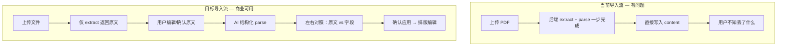
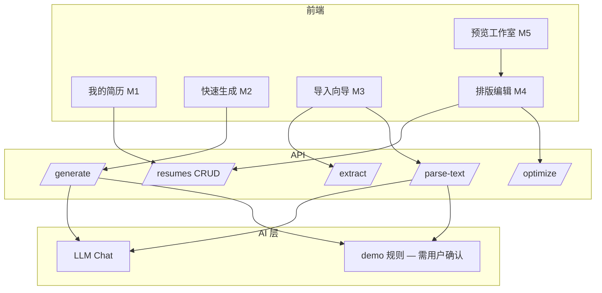

# 简历功能商业上线规划报告

> **项目**：mianshi 简历工作台  
> **文档版本**：v1.2 · 2026-06-23（P1 完成后对齐）  
> **当前综合完成度**：**~92%**  
> **商业上线目标**：**100%**（功能完整 + 体验达标 + 测试覆盖 + 可运维）

---

## 1. 执行摘要

简历模块已具备「多份简历 · AI 生成 · 导入 · 排版编辑 · 导出 · 公开分享」的完整主链路，适合**内测与种子用户**，接近商业上线。

| 维度 | 现状（2026-06-23） | 上线要求 |
|------|---------------------|----------|
| **导入解析** | 三步向导 + fieldCoverage 对照 + 扫描 PDF 引导 | ✅ 已达标 |
| **多简历管理** | 卡片 CRUD + ResumeSwitcher + E2E | ✅ 已达标 |
| **分享** | 公开 `/r/:token` + 过期 7/30/90/永久 | ✅ 已达标（密码保护待 P2） |
| **测试** | 5 套简历 E2E + 4 项 API 回归 | 缺 DOCX fixture、过期 E2E |
| **产品预期** | 全站「智能识别 + 重新排版」 | ✅ 已统一 |

**剩余 polish**：pdf.js 块排序、M10 投递摘要 UI、分享密码、多页 PDF edge case。

**建议节奏**：Phase 2 收尾 + 生产部署（~1 周）→ Phase 3 polish（可选）。

---

## 2. 模块完成度矩阵

| # | 模块 | 路由 | 当前 | 目标 | 剩余项 |
|---|------|------|------|------|--------|
| M1 | 我的简历 | `/resume/mine` | 95% | 100% | 空状态引导 polish |
| M2 | AI 快速生成 | `/resume/generate` | 90% | 100% | 独立 preview API（可选） |
| M3 | 导入并优化 | `/resume/optimize` | **92%** | 100% | pdf.js 块排序 PoC |
| M4 | 排版编辑 | `/resume/edit` | **94%** | 100% | 离开未保存拦截 |
| M5 | 预览/模板 | 编辑页右侧 | **93%** | 100% | 模板市场 |
| M6 | 分模块 AI 优化 | 编辑页 | 85% | 100% | 编辑页 JD 入口更显眼 |
| M7 | 导出 | 顶栏 | 85% | 100% | 多页 PDF e2e 稳定性 |
| M8 | 分享 | 弹窗 + `/r/:token` | **90%** | 100% | 密码保护；过期 E2E |
| M9 | 云端存储 | 自动 | 90% | 100% | 冲突/离线提示 |
| M10 | 与主站联动 | sync-summary | 70% | 100% | 投递页摘要卡片 UI |

**加权综合**：**~92%**

---

## 3. 商业对标（老鱼简历 / 超级简历）

| 能力 | 竞品常见 | mianshi 现状 | 上线策略 |
|------|----------|--------------|----------|
| PDF 导入 | 原文预览 → 字段对照 | 三步向导 + fieldCoverage | ✅ 已做 |
| DOCX 导入 | 支持 | mammoth 支持 | ✅ 已做 |
| 扫描件 OCR | 云 OCR | 错误码 + 粘贴引导 | ✅ 引导（无云 OCR） |
| 模块 | 10+ 可自定义 | 6 + 3 扩展模块 | 部分达标 |
| 头像 | 上传裁剪 | base64 + AvatarCropModal | ✅ 已做 |
| 模板 | 20+ 市场 | 8 套 CSS | P2 模板市场 |
| 公开分享链接 | 有 | `/r/:token` + 过期 | ✅ 已做 |
| 多端 | 响应式 | 编辑页 Tab 预览 | ✅ 已做 |
| 导出 PDF | 服务端矢量 | 浏览器 + 服务端 PDF | 双路径已有 |

**产品定位句（对外）**：  
> 「上传或描述自己，AI 帮你结构化内容并在专业模板上排版——不是 PDF 像素级复制，而是可编辑、可优化、可导出的智能简历。」

---

## 4. 差距分析

### 4.1 UI / 视觉

| 项 | 问题 | 改进 |
|----|------|------|
| 编辑页三栏 | 小屏 `< lg` 仅单栏，预览难用 | 底部 Tab：编辑 / 预览 |
| 卡片 hover | 仅桌面 hover 显示操作 | 移动端常显「继续编辑」 |
| 模板缩略图 | 4 套，与市场页未统一 | 模板选择器 + 大图预览 |
| 头像 | CSS 占位圆，非真实照片 | 基本信息支持上传 + 预览裁剪 |
| 加载/错误 | 部分仅 toast | 全页 skeleton + 可重试 |
| 演示模式 | Banner 有，但 parse 仍静默 demo | 导入/生成/优化统一 **Demo 确认弹窗** |

### 4.2 产品体验 / 流程



| 流程 | 缺口 |
|------|------|
| 新建 → 编辑 | 无 onboarding 引导（首次用户） |
| 多份简历 | `switchResume` / `deleteResumeById` 已实现，**UI 未暴露** |
| 导入 | upload 与 parse 耦合；无对照页 |
| 生成 | 生成后直接跳转，无「预览再保存」 |
| 优化 | 全文优化有 compare；**导入 parse 无 compare** |
| 分享 | `shareUrl` 指向 `/resume` 非公开页，易误导 |
| 自动保存 | 无「离开未保存」拦截（debounce 丢失窗口） |

### 4.3 功能 / 后端

| API | 状态 | 待补 |
|-----|------|------|
| `GET/POST /resumes` | ✅ | 列表分页（用户 >20 份时） |
| `GET/PUT/DELETE /resumes/:id` | ✅ | — |
| `POST /upload` | ⚠️ | 拆为 `POST /extract` + `POST /parse-text` |
| `POST /parse-text` | ✅ | 返回 `source: llm\|demo` + 字段覆盖率 |
| `POST /generate` | ✅ | 生成前 `POST /generate/preview` 可选 |
| `POST /optimize` | ✅ | 分模块 optimize API（现走全文 + 前端 pick） |
| 公开分享 | ❌ | `GET /r/:token` 只读页（P2） |
| 头像存储 | ❌ | 上传接口 + content.basic.avatarUrl |
| DOCX | ❌ | mammoth 解析 |
| OCR | ❌ | Tesseract 或云 API |

**数据模型扩展（P1）**：

```typescript
// 建议新增模块
honors?: { title: string; date?: string; desc?: string }[]
certificates?: { name: string; issuer?: string; date?: string }[]
customSections?: { id: string; title: string; body: string }[]  // 富文本
basic.avatarUrl?: string
```

### 4.4 AI 能力

| 场景 | 要求 |
|------|------|
| 环境 | 生产必须配置 `LLM_API_KEY`；`LLM_FORCE_DEMO` 仅 dev |
| 降级 | demo 模式：**显式**用户确认，响应带 `source: 'demo'` |
| 解析 prompt | 保留 department/city/detail；禁止合并模块；输出覆盖率 meta |
| 生成 | 岗位对齐（已修）；增加「行业/年限」可选输入 |
| 优化 | JD 定向（已有 jobId）；编辑页露出 JD 选择 |

### 4.4 导入解析（核心痛点专项）

**根因**：`pdf-parse` 纯文本 → 丢版式 → LLM/demo 填 6 模块 → 模板重绘。

**P0 交付标准**（不承诺 1:1 版式，承诺内容可追溯）：

1. 上传后先展示 `extractedText`（可编辑，≥30 字校验）
2. 用户点击「开始识别」才调用 parse
3. 识别结果页：左侧原文摘要，右侧结构化字段树
4. 字段旁标注「未识别 / 低置信度」（LLM 返回或规则检测）
5. demo 模式弹窗：「当前为演示数据，请配置 AI 或手动修改」
6. 产品文案全站统一：**智能识别，重新排版**

**P1 质量提升**：

- pdf.js 按 Y 坐标块排序（改善双栏乱序）
- DOCX（mammoth）
- 扫描 PDF：OCR 或明确错误码 `SCANNED_PDF_NEED_OCR`

---

## 5. 分阶段实施计划

### Phase 0 — 基线与规范（2 天）

**目标**：统一验收标准，避免再出现「未测就交付」。

| 任务 | 产出 |
|------|------|
| 本规划文档评审锁定 | 本文档 v1.0 |
| 定义 DoD 检查表 | 见 §7 |
| CI 脚本：`test:resume-all` | 串联 demo + export + e2e |
| 环境检查页/API | `GET /api/resume/health` → llmConfigured, demoMode |

**验收**：`npm run test:resume-all` 绿。

---

### Phase 1 — P0 商业阻塞项（5～7 天）

**完成后模块可达 ~88%**

#### 1.1 导入向导（M3）

- [x] API：`POST /resumes/extract`（仅抽文本，不 parse）
- [x] API：`POST /upload` 支持分步（extract + parse-text）
- [x] 前端：`ImportWizard` 三步 UI（原文 → 识别 → 对照确认）
- [x] 复用 compare modal 做 parse compare
- [x] demo 模式：全路径强确认弹窗（简历优化/分模块/Admin 导入）

#### 1.2 多简历管理 UI（M1 + M4）

- [x] 卡片：删除、复制、重命名
- [x] 编辑页顶栏：ResumeSwitcher
- [x] `?id=` 与列表状态同步

#### 1.3 AI 状态与文案（M2/M6）

- [x] 无 LLM / 不可达：Banner + 链到 help
- [x] LLM 健康探测 `?probe=1`（import / resume / info）
- [x] 主要 AI 响应展示 `source` badge

#### 1.4 分享诚实化（M8 interim）

- [x] 公开分享 `GET /r/:token`
- [x] 文案区分「公开链接」vs「编辑页（需登录）」

#### 1.5 测试（必做）

- [x] `test:import-extract`
- [x] e2e：`resume-import-wizard.spec.ts`
- [x] e2e：`resume-export.spec.ts`
- [x] e2e：`resume-crud.spec.ts`

---

### Phase 2 — P1 体验对齐（5～7 天）

**完成后模块可达 ~95%**

#### 2.1 数据模型扩展（M4/M5）

- [x] honors / certificates / customSections
- [x] Editor + Preview 同步

#### 2.2 头像上传（M4）

- [x] base64 存 content.basic.avatarUrl
- [x] Editor 上传 + Preview 展示

#### 2.3 格式与解析（M3）

- [x] DOCX 支持（mammoth）
- [ ] pdf.js 块排序 PoC
- [x] 扫描 PDF 友好错误 + 引导粘贴（`SCANNED_PDF_NEED_OCR` + `ScannedPdfGuide`）

#### 2.4 移动端（M4/M5）

- [x] 编辑页 Tab：内容 | 预览
- [x] 我的简历卡片网格 1 列（小屏 `max-sm:w-full`）

#### 2.5 每份简历独立配置

- [x] `sectionOrder` / `previewSettings` 存 resume 级 `layoutConfig`（非 localStorage）

#### 2.6 测试

- [ ] DOCX fixture 回归
- [x] 扩展模块渲染 e2e

---

### Phase 3 — P2 商业增强（3～5 天）

**完成后 ~98%**

- [x] 公开分享：`POST /resumes/:id/share` → token；`GET /r/:token` 只读页
- [x] 模板增至 8 套或模板画廊页
- [x] 服务端 PDF（puppeteer/playwright PDF 或 pdfkit）
- [x] 首次用户 onboarding（3 步 tooltip）
- [x] 投递联动：岗位页「用当前简历优化」深链

---

### Phase 4 — P3  polish & 运维（2～3 天）

**100% 上线清单**

- [x] 性能：预览 debounce、大简历 parse 超时 UI
- [x] 安全：上传大小限制、MIME 校验、rate limit
- [x] 无障碍：表单 label、键盘导航、对比度抽检
- [x] 监控：`resume.upload|parse|generate|export` metrics 仪表盘
- [x] 文档：用户帮助「导入说明」「演示模式说明」
- [x] PostgreSQL 生产验证 + json 迁移脚本

---

## 6. 逻辑架构（目标态）



---

## 7. Definition of Done（100% 验收标准）

### 7.1 全局

- [ ] 所有 AI 路径返回 `source`，前端可见
- [ ] 无 LLM 时核心路径不静默造假数据
- [ ] `npm run test:resume-all` 通过
- [ ] Playwright 简历套件 ≥ 8 cases 全绿
- [ ] 生产环境 `LLM_API_KEY` 已配置且 health 为 llm

### 7.2 分模块

| 模块 | 100% 标准 |
|------|-----------|
| M1 我的简历 | 新建/删除/复制/重命名；卡片预览准确；空状态 CTA |
| M2 生成 | 岗位与输入一致；生成后可预览再进编辑；demo 可识别 |
| M3 导入 | 三步向导；原文可编辑；对照确认；PDF/DOCX/TXT；错误码清晰 |
| M4 编辑 | 六模块+扩展模块；富文本；拖拽排序；简历切换；头像 |
| M5 预览 | 4+ 模板；间距/Accent；一页模式；移动端可看 |
| M6 优化 | 全文+分模块 compare；JD 可选；应用可撤销 |
| M7 导出 | PNG/JPG/PDF 均 e2e；多页不截断；文件名含姓名 |
| M8 分享 | 公开链接可用 **或** UI 无虚假链接 |
| M9 存储 | PG 双写验证；自动保存失败可重试 |
| M10 联动 | 投递偏好 sync-summary 一键可用 |

---

## 8. 测试矩阵

| 用例 ID | 类型 | 描述 | 阶段 |
|---------|------|------|------|
| T-01 | unit | demoParse 字段覆盖率 | P0 |
| T-02 | unit | alignGeneratedToTarget 岗位 | ✅ |
| T-03 | unit | export stripModernColorFunctions | ✅ |
| T-04 | api | extract PDF ≥30 字 | P0 |
| T-05 | api | parse-text 返回 source | P0 |
| T-06 | e2e | PNG/JPG 下载 | ✅ |
| T-07 | e2e | PDF 打印/下载 | P0 |
| T-08 | e2e | 导入向导三步 | P0 |
| T-09 | e2e | 删除/切换简历 | P0 |
| T-10 | e2e | AI 生成进编辑 | P1 |
| T-11 | api | DOCX extract | P1 |
| T-12 | e2e | 公开分享只读 | P2 |

**本地命令（目标）**：

```bash
# API
cd mianshi-api && npm run test:resume-demo

# 前端单元
cd mianshi-frontend && npm run test:export

# E2E（需 API+PG+dev server）
cd mianshi-frontend && npm run test:e2e -- e2e/resume-*.spec.ts
```

---

## 9. 风险与依赖

| 风险 | 影响 | 缓解 |
|------|------|------|
| LLM 成本高/不稳定 | 解析质量波动 | 超时 fallback + 用户手动编辑 |
| PDF 双栏乱序 | 字段错位 | pdf.js 坐标排序；用户在对照页修正 |
| 扫描 PDF | 无法导入 | OCR 或明确引导粘贴 |
| html2canvas 多页 | 导出截断 | 分页导出或服务端 PDF |
| json 存储生产 | 数据丢失 | 强制 PG；迁移脚本 |
| 用户期望 1:1 | 差评 | 文案与向导管理预期 |

**硬依赖**：

- `mianshi-api/.env`：`LLM_API_KEY`（生产必填）
- PostgreSQL（多用户生产）
- 开发验证前：`rm -rf node_modules/.vite` 后重启 frontend（export 相关）

---

## 10. 执行顺序建议（Next Actions）

**本周立即开始（Phase 1 Sprint 1）**：

1. **拆分 upload API** + ImportWizard 第一步「原文预览」
2. **SavedResumeCard 删除 + 编辑页简历切换**
3. **分享弹窗去误导链接**
4. **e2e：import-wizard + resume-crud + PDF export**
5. **`test:resume-all` 聚合脚本**

每完成一项：**build → 跑相关测试 → 再标记完成**（项目强制验证纪律）。

---

## 11. 附录：关键代码索引

| 能力 | 路径 |
|------|------|
| API 路由 | `mianshi-api/src/routes/resume.ts` |
| 解析/生成/优化 | `mianshi-api/src/services/resume-optimize.ts` |
| 存储 | `mianshi-api/src/services/resume-store.ts` |
| 状态中心 | `mianshi-frontend/src/pages/resume/ResumeProvider.tsx` |
| 导入页 | `mianshi-frontend/src/pages/resume/views/OptimizeView.tsx` |
| 编辑页 | `mianshi-frontend/src/pages/resume/views/EditView.tsx` |
| 导出 | `mianshi-frontend/src/components/resume/resumeExport.ts` |
| 模块定义 | `mianshi-frontend/src/components/resume/resumeSections.ts` |
| E2E 导出 | `mianshi-frontend/e2e/resume-export.spec.ts` |

---

*文档维护：每 Phase 结束更新完成度百分比与 checkbox。*
